==========================================
Atualização de *release*
==========================================

Toda vez que uma nova *release* (pacote de atualização **estável**) do Portal
Institucional Padrão em Plone for lançada no :term:`PyPI`, a Comunidade/Patrocinador avisará
na lista de discussões :term:`PloneGov-BR`.

.. note :: Atualmente não há uma frequência estabelecida para criação de
           *releases* do produto principal *brasil.gov.portal*.

É **muito importante** que seja feita a leitura do changelog da release, geralmente
presente em https://github.com/plonegovbr/portalpadrao.release/releases/tag/X.X, pois podem
ser necessários passos adicionais de configuração. Sempre leia atentamente para
evitar problemas futuros.

Se você tiver montado o seu ambiente de produção como demonstrado em
http://identidade-digital-de-governo-plone.readthedocs.io/en/latest/producao/#usando-repositorio,
(ou seja, usando como base o repositório portal.buildout), para atualizar o seu ambiente,  
basta dar checkout na versão desejada, executar o buildout, subir a(s) instância(s) e,  
se aplicável, executar upgradeSteps. Isso tem a vantagem de receber também possíveis  
mudanças/melhorias de configuração (e não só mudanças de versões de pacotes). Se  
for esse o seu caso, acesse o diretório de seu buildout e execute o seguinte comando  
para atualizar para a versão desejada de portal.buildout:

::

    # X.X.X.X é a última tag em releases, presente em
    # https://github.com/plonegovbr/portal.buildout/releases
    git checkout tags/X.X.X.X

Casa esteja utilizando um buildout customizado, para atualizar um portal existente,
você precisará alterar o número da versão de release usada no *extends* de seu arquivo
de buildout (que pode ser base.cfg, buildout.cfg ou qualquer outro), rodar o
*buildout*, subir as a(s) instância(s) e, se aplicável, executar upgradeSteps.

Exemplo: suponha que você tenha um buildout customizado utilizando a versão
1.1.5.3 do IDG, contendo a seguinte url no extends do seu arquivo de buildout:

::

    extends =
        http://downloads.plone.org.br/release/1.1.5.3/versions.cfg

Verificando em https://github.com/plonegovbr/portalpadrao.release/releases, você percebe
que há uma versão mais atual, a 1.2, e deseja atualizar. Após ler todos os
detalhes do release em https://github.com/plonegovbr/portalpadrao.release/releases/tag/1.2
e efetuando possíveis alterações (se aplicáveis), altere seu arquivo de buildout para:

::

    extends =
        http://downloads.plone.org.br/release/1.2/versions.cfg

Rode o *buildout*, suba as a(s) instância(s) e, se aplicável, execute os upgradeSteps.
Seu portal estará atualizado.

As versões disponibilizadas pelo Portal Padrão e suas dependências podem ser vistas em
https://github.com/plonegovbr/portalpadrao.release/. Caso o seu servidor não
possua acesso externo, você precisará baixar e usar o arquivo versions-sem-extends.cfg ao
invés da url do versions.cfg ao alterar no seu arquivo de buildout.

Para entender melhor a diferença entre versions.cfg e versions-sem-extends.cfg, acesse
https://github.com/plonegovbr/portalpadrao.release#user-content-por-que-versionscfg-e-versions-sem-extendscfg-qual-devo-usar

.. note :: Pode ser necessário, entre releases, executar o que chamamos de
           "upgradeSteps". Favor ler a seção a seguir para entender o processo.

.. warning :: **Não utilize portal_quickinstaller** para reinstalar versões do IDG
              após atualização. Se quiser entender a motivação disso acesse a
              seção "Execução de reinstall em portal_quickinstaller" nesse
              documento. O jeito correto de se atualizar é com o uso de
              upgradeSteps.

Execução de upgradeSteps
------------------------

Na atualização entre releases, pode ser necessária a execução do que chamamos
de "upgradeSteps", que são basicamente passos de atualização entre uma versão
e outra do IDG ou de seus componentes. Por exemplo: quando o Portal Padrão foi
atualizado da versão 1.0.5 para 1.1.4, foi necessário atualizar a forma como a
capa armazenava os tiles, portanto, logo após executar o buildout, precisamos
executar também os seus upgradeSteps para que o portal funcione corretamente.

Você deve ter percebido isso ao acessar o painel de controle do Plone ao
atualizar a versão do IDG e a opção "Complementos":

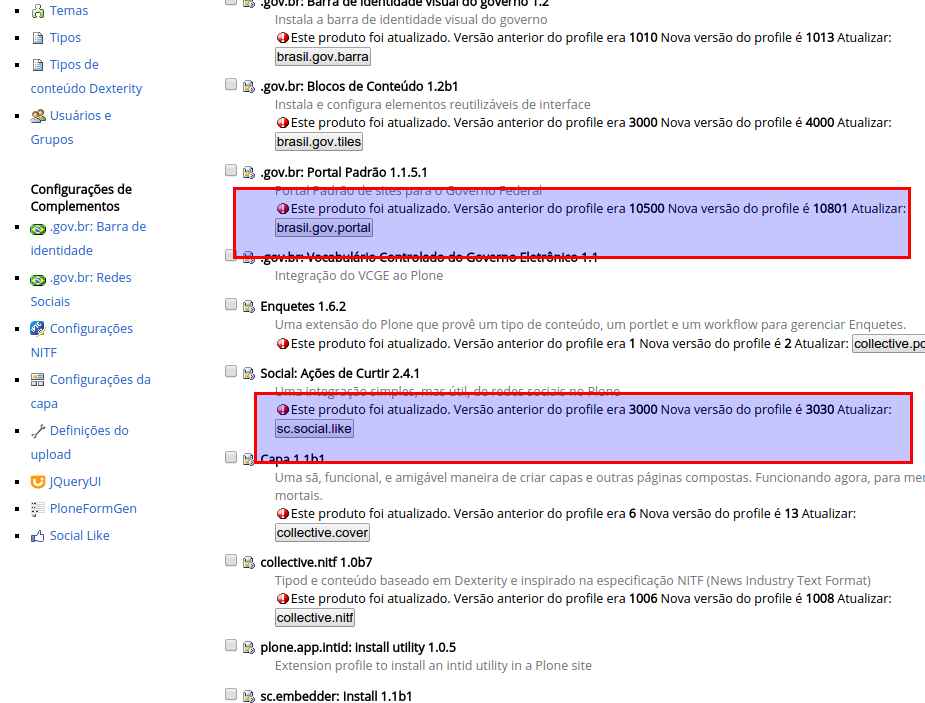

Veja que há um indicativo para atualização de versões.

Acontece que, da forma como o IDG foi feito, não necessariamente todas as
dependências adicionadas aparecem nesse painel de controle para atualização.
A idéia é corrigir isso como apresentado em
https://github.com/plonegovbr/brasil.gov.portal/issues/325#issuecomment-271943352
mas enquanto isso não é feito, precisamos executar os upgradeSteps de
uma outra maneira.

Para fazer isso, você precisa acessar o que chamamos de "ZMI", ou
"Zope Management Interface", que é um painel de controle utilizado para mexer
em configurações do Zope, servidor de aplicação onde o Plone é executado.

.. note :: Recomendamos o acesso a essas telas diretamente nas instâncias sem
           passar por servidores web ou proxy intermediários para evitar timeouts.

Para acessar essa interface você deve ter o perfil "Administrador" (não
confundir com "Administrador do Site"), que é o mesmo perfil usado quando o
seu site Plone foi criado.

.. warning :: **Muito cuidado ao mexer na ZMI** uma vez que modificações
              incorretas nessa tela podem acarretar indisponibilidade do seu
              portal! Se você não tem familiaridade com a interface, recomendamos
              fazer **estritamente** o que foi descrito aqui e sair da ZMI na
              sequência.

.. warning :: **Sempre efetue backup antes de prosseguir.**

Estando logado como "Administrador", para acessar a ZMI, basta adicionar `/manage`
no fim de sua url. Você deve obter uma tela como a seguinte:

1. Se na sua instalação não aparecer pedindo para atualizar o Plone como na
imagem abaixo, pode seguir diretamente para o item 2.

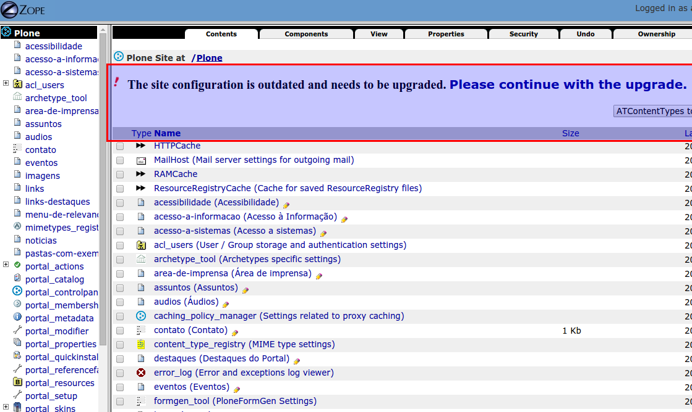

Essa imagem indica que o Plone também precisa ser atualizado. Clique no link
"Please continue with the upgrade".

.. image:: images/zmi02.png

Lembre-se sempre de efetuar backup antes de prosseguir. Role até o fim da página:

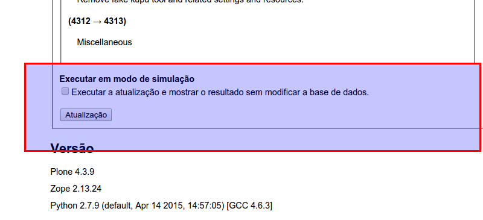

Prossiga clicando no botão "Atualização" como na imagem acima.

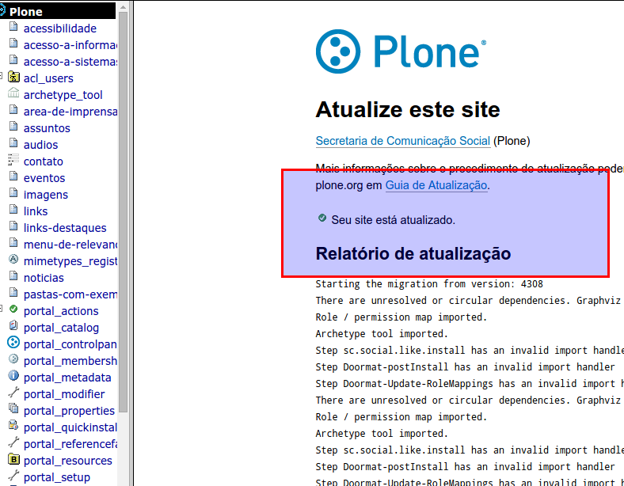

Se aparecer "Seu site está atualizado", indica que a atualização foi feita com
sucesso.

2. Iremos atualizar o IDG e suas dependências. Estando na ZMI, no menu da
esquerda, selecione a opção "portal_setup". Na sequência, clique na aba
"Upgrades" na tela central.

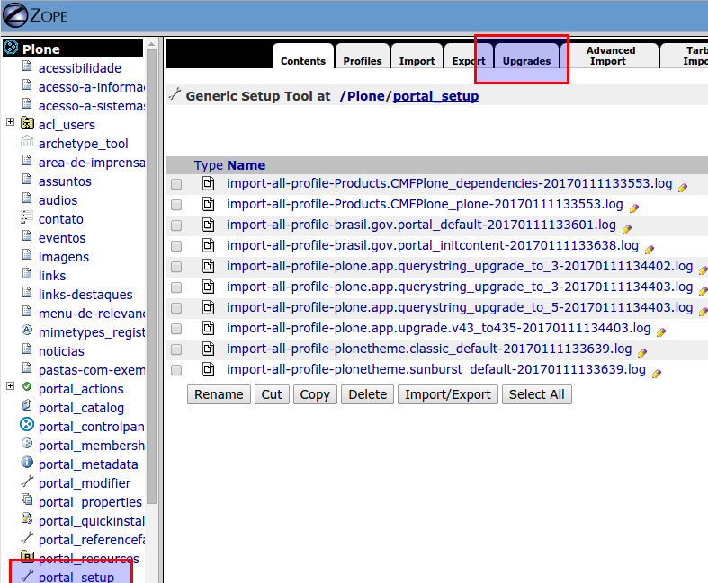

3. A frase "These profiles have pending upgrades" na imagem abaixo indica que
há pacotes que precisam ter executados os seus upgradeSteps. Clique no select e,
se houver o `brasil.gov.portal:default` selecione-o primeiro e logo em sequência
no botão "Choose Profile" ao lado.

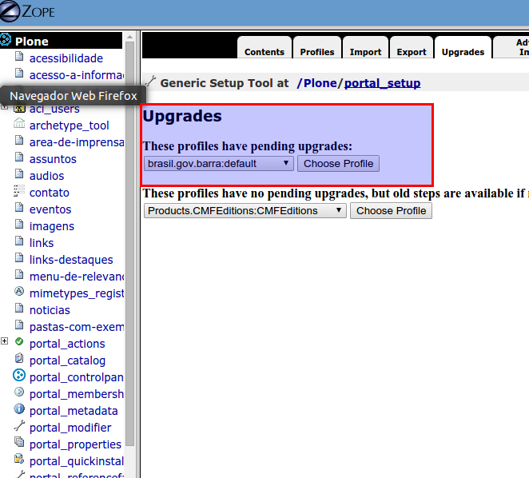

4. A tela será recarregada, podendo aparecer alguns checkboxes selecionados e
outros sem selecionar como demonstrado na tela abaixo:

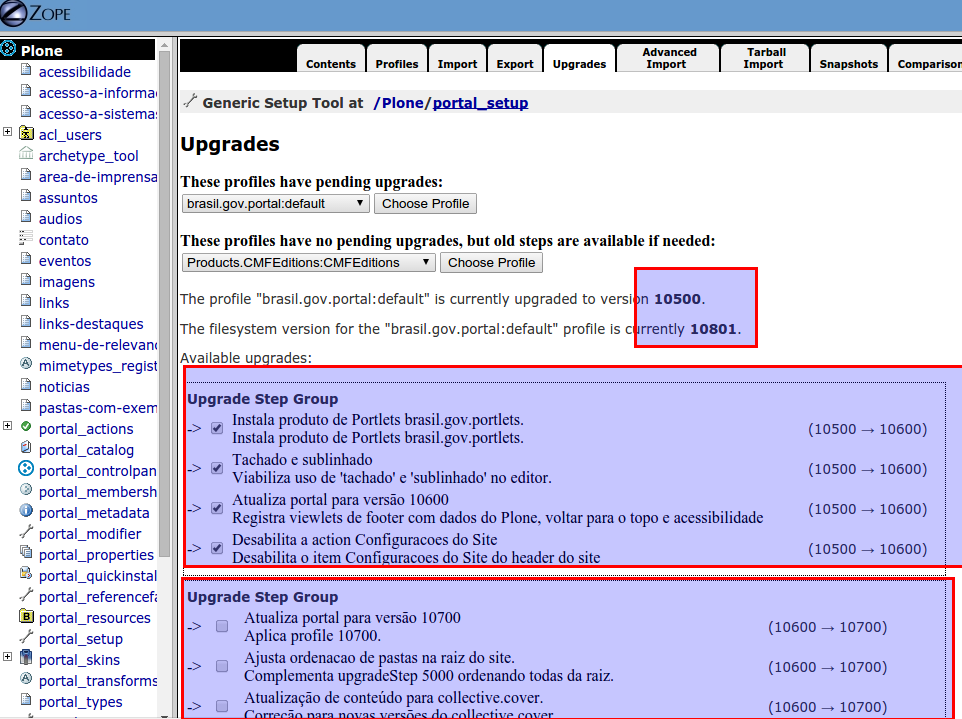

**Deixe como está** e role até o fim da tela, clicando no botão "Upgrade". Espere
o processo acabar (pode ser que demore dependendo do volume de objetos no seu site),
**não recarregue a página** manualmente, após a finalização da atualização ela é
recarregada automaticamente.

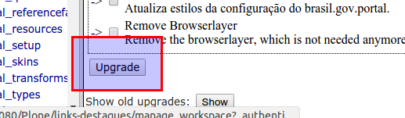

A tela será recarregada e, caso tenha havido checkboxes não selecionados no passo
anterior, eles estarão **automaticamente** selecionados agora. Repita o processo
do passo anterior clicando em "Upgrade" no fim da página (novamente, aguarde o
processo acabar, dependendo do volume de objetos no portal pode ser que demore).

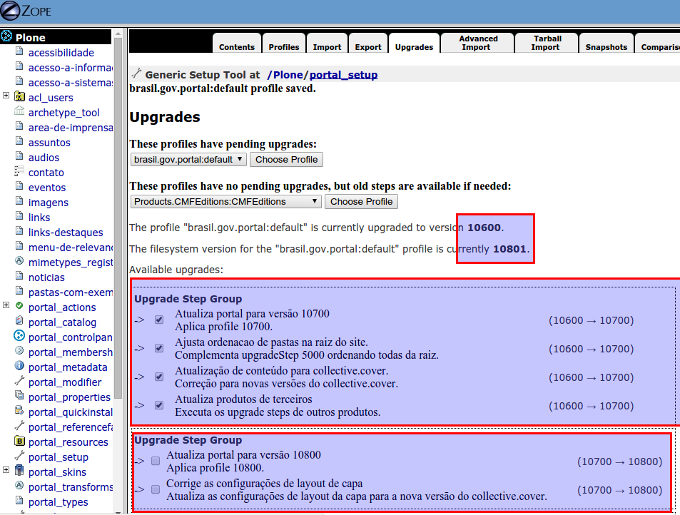

Quando acabarem os upgradeSteps do pacote selecionado, ele sumirá do select.
Repita o processo para os demais pacotes que estiverem no select.

Quando todos os pacotes forem atualizados, você terá uma tela como essa:

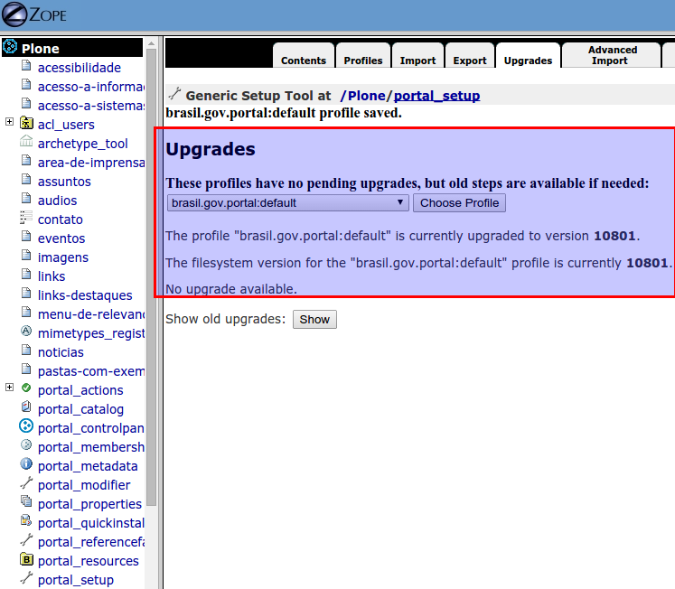

Ou seja, o select indicando que pacotes precisam ser atualizados não existe mais
indicando que todos foram atualizados. Todos os upgradeSteps foram executados.

Execução de reinstall em portal_quickinstaller
----------------------------------------------

Apesar de no passado na comunidade Plone ter sido comum reinstalar pacotes pela
ZMI no portal_quickinstaller, isso **não é considerado mais uma boa prática** e
**não deve ser feito em ambientes IDG** pois ele não está preparado nem foi
testado pra isso. Nas versões mais atuais do Plone (marcos 5.x.x. e 5.1.x) é
**removido** o suporte ao portal_quickinstaller e ele será completamente
excluído no Plone 6.
(Ver https://github.com/plone/Products.CMFPlone/issues/1340 e
https://github.com/plone/Products.CMFPlone/issues/1775).

Essa decisão foi tomada porque a reinstalação, por desinstalar o pacote e
reinstalar, não só ele, mas todas as dependências definidas em metadata.xml, é
completamente imprevisível pois nunca se sabe se uma dependência tenta tratar
dados que por ventura tenham sido alterados pelo usuário final. Quando isso não
é feito, dados podem ser perdidos.

Assim, apesar de alguns pacotes aparecerem em vermelho no portal_quickinstaller,
eles **não devem ser reinstalados**. Exemplo de como pode estar seu portal_quickinstaller
se você tinha uma versão mais antiga, como a 1.0.5 e atualizou para uma mais nova
(por exemplo 1.2):

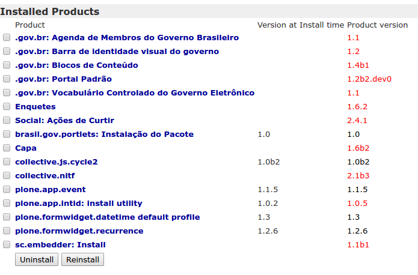

Ou se instalou diretamente a partir da 1.1.5.1 e atualizou para a mais nova,
1.2:

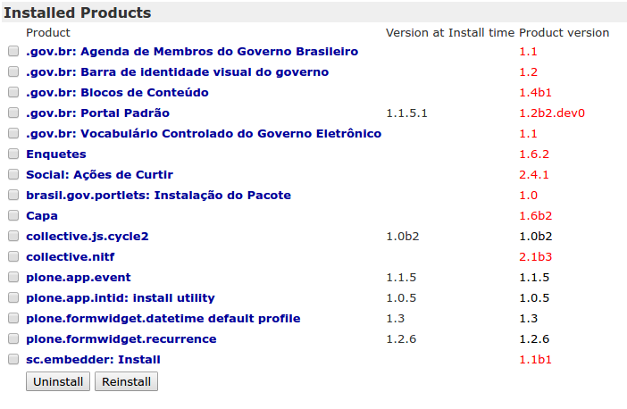

Isso não quer dizer que os pacotes estão incompletos ou não foram instalados
corretamente: como já foi falado em seções anteriores,  o que não pode faltar é
a execução de upgradeSteps caso eles existam numa atualização de versão.

Se você chegou a efetuar o reinstall em algum produto no seu portal durante uma
atualização de versão do IDG, configurações de painel de controle (como nome
do site e outras configurações) serão **resetadas** para o Padrão IDG. Nossa
recomendação é executar o comando de `Undo` se tiver efetuado algum reinstall
nesse contexto.

Considerações Finais
--------------------

Encontrando incorreções, colabore com melhorias. Se não se sentir seguro(a) para
corrigir o código fonte de um produto, verifique os *tickets* existentes no
:term:`GitHub` ou faça novo reporte (*New issue*) no produto específico do GitHub
(https://github.com/plonegovbr) – com o maior número de detalhes que puder informar.
Reportar problemas é um trabalho nobre. :)

.. note :: A partir da versão 1.0.1 do Portal Institucional Padrão em Plone, o
           *buildout* passou a depender de um arquivo único de versões. Essa é uma
           melhoria que faz o Portal Padrão funcionar como o Plone (por padrão).
           Esta foi a modificação realizada para trazer esta melhoria na atualização
           do produto:
           https://github.com/plonegovbr/portal.buildout/blob/519edff6bd0a08b470cb02157122856ad0ad460f/buildout.d/base.cfg#L5
