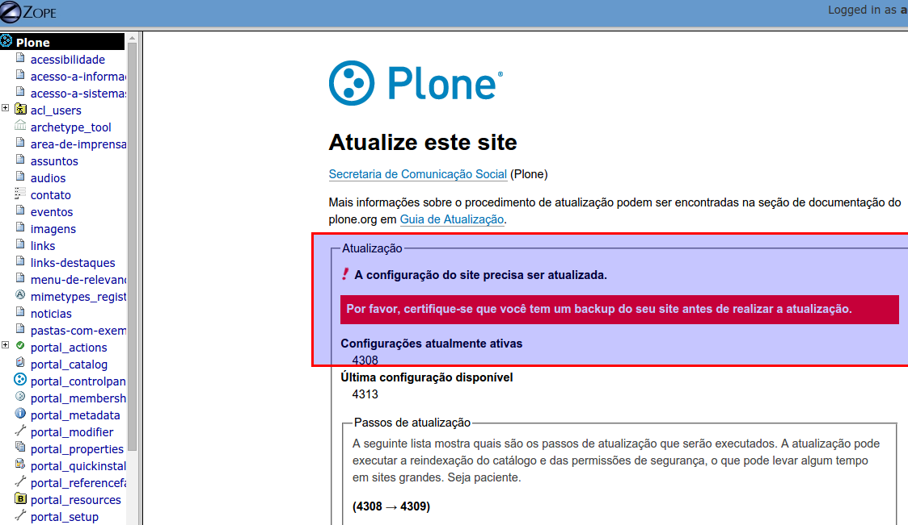

==========================================
Atualização de *release*
==========================================

Toda vez que uma nova *release* (pacote de atualização **estável**) do Portal
Institucional Padrão em Plone for lançada no :term:`PyPI`, a Comunidade avisará
na lista de discussões :term:`PloneGov-BR`.

.. note :: Atualmente não há uma frequência estabelecida para criação de
           *releases* do produto principal *brasil.gov.portal*.

Para atualizar um portal existente, basta alterar a versão do *buildout* para o
número de versão mais atual, na url do `extends` do *buildout* em base.cfg,
(https://github.com/plonegovbr/portal.buildout/blob/master/buildout.d/base.cfg),
rodar o *buildout* e reiniciar a(s) instância(s).

As versões disponibilizadas pelo Portal Padrão podem ser vistas em
https://github.com/plonegovbr/portalpadrao.release. Caso o seu servidor não
possua acesso externo, você precisa usar o arquivo versions-sem-extends.cfg ao
invés do versions.cfg ao alterar o base.cfg. Para maiores informações sobre a
diferença entre versions.cfg e versions-sem-extends.cfg, acesse
https://github.com/plonegovbr/portalpadrao.release#user-content-por-que-versionscfg-e-versions-sem-extendscfg-qual-devo-usar

.. note :: Pode ser necessário, entre releases, executar o que chamamos de
           "upgradeSteps". Favor ler a seção a seguir para entender o processo.

Execução de upgradeSteps
------------------------

Na atualização entre releases, pode ser necessária a execução do que chamamos
de "upgradeSteps", que são basicamente passos de atualização entre uma versão
e outra do IDG ou de seus componentes. Por exemplo: quando o Portal Padrão foi
atualizado da versão 1.0.5 para 1.1.4, foi necessário atualizar a forma como a
capa armazenava os tiles, portanto, logo após executar o buildout, precisamos
executar também os seus upgradeSteps para que o portal funcione corretamente.

Você deve ter percebido isso ao acessar o painel de controle do Plone ao
atualizar a versão do IDG e a opção "Complementos":

Veja que há um indicativo para atualização de versões.

Acontece que, da forma como o IDG foi feito, não necessariamente todas as
dependências adicionadas aparecem nesse painel de controle para atualização.
A idéia é corrigir isso como apresentado em
https://github.com/plonegovbr/brasil.gov.portal/issues/325#issuecomment-271943352
mas enquanto isso não é feito, precisamos executar os upgradeSteps de
uma outra maneira.

Para fazer isso, você precisa acessar o que chamamos de "ZMI", ou
"Zope Management Interface", que é um painel de controle utilizado para mexer
em configurações do Zope, servidor de aplicação onde o Plone é executado.

.. note :: Recomendamos o acesso a essas telas diretamente nas instâncias sem
           passar por servidores web ou proxy intermediários para evitar timeouts.

Para acessar essa interface você deve ter o perfil "Administrador" (não
confundir com "Administrador do Site"), que é o mesmo perfil usado quando o
seu site Plone foi criado.

.. warning :: **Muito cuidado ao mexer na ZMI** uma vez que modificações
              incorretas nessa tela podem acarretar indisponibilidade do seu
              portal! Se você não tem familiaridade com a interface, recomendamos
              fazer **estritamente** o que foi descrito aqui e sair da ZMI na
              sequência.

.. warning :: **Sempre efetue backup antes de prosseguir.**

Estando logado como "Administrador", para acessar a ZMI, basta adicionar `/manage`
no fim de sua url. Você deve obter uma tela como a seguinte:

1. Se na sua instalação não aparecer pedindo para atualizar o Plone como na
imagem abaixo, pode seguir diretamente para o item 2.

Essa imagem indica que o Plone também precisa ser atualizado. Clique no link
"Please continue with the upgrade".

Lembre-se sempre de efetuar backup antes de prosseguir. Role até o fim da página:

.. image:: images/zmi03.png

Prossiga clicando no botão "Atualização" como na imagem acima.

Se aparecer "Seu site está atualizado", indica que a atualização foi feita com
sucesso.

2. Iremos atualizar o IDG e suas dependências. Estando na ZMI, no menu da
esquerda, selecione a opção "portal_setup". Na sequência, clique na aba
"Upgrades" na tela central.

3. A frase "These profiles have pending upgrades" na imagem abaixo indica que
há pacotes que precisam ter executados os seus upgradeSteps. Clique no select e,
se houver o `brasil.gov.portal:default` selecione-o primeiro e logo em sequência
no botão "Choose Profile" ao lado.

4. A tela será recarregada, podendo aparecer alguns checkboxes selecionados e
outros sem selecionar como demonstrado na tela abaixo:

**Deixe como está** e role até o fim da tela, clicando no botão "Upgrade". Espere
o processo acabar (pode ser que demore dependendo do volume de objetos no seu site),
**não recarregue a página** manualmente, após a finalização da atualização ela é
recarregada automaticamente.

A tela será recarregada e, caso tenha havido checkboxes não selecionados no passo
anterior, eles estarão **automaticamente** selecionados agora. Repita o processo
do passo anterior clicando em "Upgrade" no fim da página (novamente, aguarde o
processo acabar, dependendo do volume de objetos no portal pode ser que demore).

Quando acabarem os upgradeSteps do pacote selecionado, ele sumirá do select.
Repita o processo para os demais pacotes que estiverem no select.

Quando todos os pacotes forem atualizados, você terá uma tela como essa:

.. image:: images/zmi09.png

Ou seja, o select indicando que pacotes precisam ser atualizados não existe mais
indicando que todos foram atualizados. Todos os upgradeSteps foram executados.

Considerações Finais
--------------------

Encontrando incorreções, colabore com melhorias. Se não se sentir seguro(a) para
corrigir o código fonte de um produto, verifique os *tickets* existentes no
:term:`GitHub` ou faça novo reporte (*New issue*) no produto específico do GitHub
(https://github.com/plonegovbr) – com o maior número de detalhes que puder informar.
Reportar problemas é um trabalho nobre. :)

.. note :: A partir da versão 1.0.1 do Portal Institucional Padrão em Plone, o
           *buildout* passou a depender de um arquivo único de versões. Essa é uma
           melhoria que faz o Portal Padrão funcionar como o Plone (por padrão).
           Esta foi a modificação realizada para trazer esta melhoria na atualização
           do produto:
           https://github.com/plonegovbr/portal.buildout/blob/519edff6bd0a08b470cb02157122856ad0ad460f/buildout.d/base.cfg#L5
