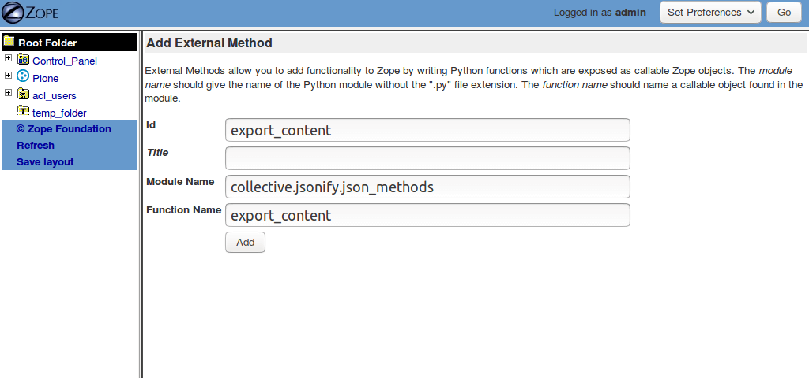
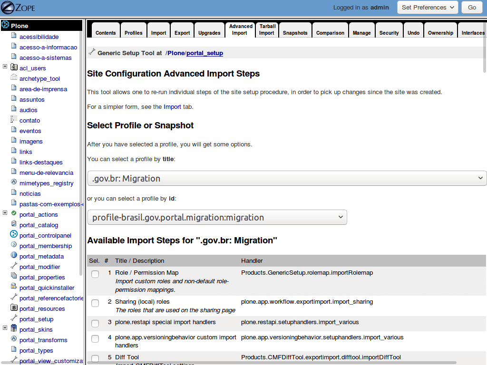

========
Migração
========

O IDG suporta exportação e importação de conteúdo em formato JSON.

Exportar conteúdo
=================

A exportação de conteúdo é suportada em sites rodando versões de Plone 2.1 ou superiores.
Isso quer dizer que você pode migrar seu site para o IDG utilizando o procedimendo descrito na sequência.

Instale o `collective.jsonify <https://pypi.python.org/pypi/collective.jsonify>`_ adicionando ele na sua configuração de buildout:

.. code-block:: ini

    [buildout]
    …
    eggs =
        …
        collective.jsonify

Rode o :command:`buildout` e reinicie sua instância.

O collective.jsonify pode ser configurado para exportar conteúdo no filesystem,
ou para permitir acesso remoto por outra instância Plone.
Nesta documentação nós exporaremos só a primeira opção.
Para mais informação, consulte a documentação do pacote.

Na ZMI, acesse a raiz da instância Zope e adicione um "External Method" com a seguinte informação:

* id: ``export_content``
* module name: ``collective.jsonify.json_methods``
* function name: ``export_content``

Para exportar todo o conteúdo do seu site simplesmente acesse da seguinte forma:

.. code-block:: console

    $ curl http://localhost:8080/Plone/export_content
    SUCCESS :: exported 191 items from http://localhost:8080/Plone

Pode acompanhar em todo momento o estado da exportação no log de eventos da instância:

.. code-block:: console

    2017-12-15 17:01:09 INFO collective.jsonify export exported /Plone/destaques to /tmp/content_Plone_2017-12-15-17-01-09/0/1.json
    2017-12-15 17:01:09 INFO collective.jsonify export exported /Plone/links-destaques to /tmp/content_Plone_2017-12-15-17-01-09/0/2.json
    2017-12-15 17:01:09 INFO collective.jsonify export exported /Plone/links-destaques/destaque-1 to /tmp/content_Plone_2017-12-15-17-01-09/0/3.json
    …
    2017-12-15 17:01:13 INFO collective.jsonify export exported /Plone/acessibilidade/acessibilidade to /tmp/content_Plone_2017-12-15-17-01-09/0/190.json
    2017-12-15 17:01:13 INFO collective.jsonify export exported /Plone/ultimas-noticias to /tmp/content_Plone_2017-12-15-17-01-09/0/191.json
    2017-12-15 17:01:13 INFO collective.jsonify export SUCCESS :: exported 191 items from http://localhost:8080/Plone

Por padrão o collective.jsonify exportará o conteúdo dentro da pasta ``/tmp``,
separando o mesmo em pastas numeradas sequencialmente.
Cada pasta contem por padrão até 1.000 arquivos para evitar problemas no filesystem.

É possível modificar o funcionamento do exportador.
Para mais informação, consulte a documentação do pacote.

Importar conteúdo
=================

A importação de conteúdo é muito flexível e está baseada no `collective.transmogrifier <https://pypi.python.org/pypi/collective.transmogrifier>`_.
A configuração padrão permite importar conteúdo exportado de um site rodando o IDG 1.x.

Para ativa a importação você tem deve instalar o ``brasil.gov.portal`` usando o extra ``[migration]``:

.. code-block:: ini

    [instance]
    …
    eggs +=
        …
        brasil.gov.portal[migration]

Uma outra forma de habilitar a migração é rodando o buildout da seguinte forma:

.. code-block:: console

    $ bin/buildout instance:eggs+=brasil.gov.portal[migration]

Rode o :command:`buildout` e verifique no log se as dependências da migração foram realmente instaladas antes de continuar.
Reinicie sua instância.

Edite o arquivo ``migration.cfg`` que se encontra dentro do egg pacote ``brasil.gov.portal``,
e adicione o path donde se encontram os arquivo exportados no passo anterior:

.. code-block:: ini

    [jsonsource]
    blueprint = collective.jsonmigrator.jsonsource
    path = /tmp/content_Plone_2017-12-15-17-01-09

Na ZMI, acesse o ``portal_setup`` do seu site Plone.
Selecione a aba "Advanced Import" e selecione o profile ".gov.br: Migration":

Selecione somente o Import Step com o título "Run transmogrifier pipeline".
No fundo da tela desmarque a opção "Include dependencies of steps?" e presione o botão ``Import selected steps``.

Após de alguns minutos (ou horas, dependendo da quantidade de conteúdo) o processo terá finalizado,
e o conteúdo importado se encontrará disponibilizado no Plone site usando o novo IDG 2.0.

Pode acompanhar em todo momento o estado da importação no log de eventos da instância:

.. code-block:: console

    2017-12-15 17:47:07 INFO GenericSetup.collective.transmogrifier.genericsetup Running transmogrifier pipeline migration
    2017-12-15 17:47:07 INFO brasil.gov.portal /destaques
    2017-12-15 17:47:07 INFO brasil.gov.portal /links-destaques
    …
    2017-12-15 17:47:26 INFO brasil.gov.portal /acessibilidade/acessibilidade
    2017-12-15 17:47:26 INFO brasil.gov.portal /ultimas-noticias
    2017-12-15 17:47:28 INFO GenericSetup.collective.transmogrifier.genericsetup Transmogrifier pipeline migration complete
